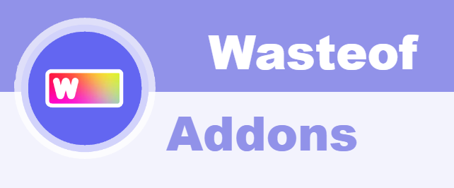
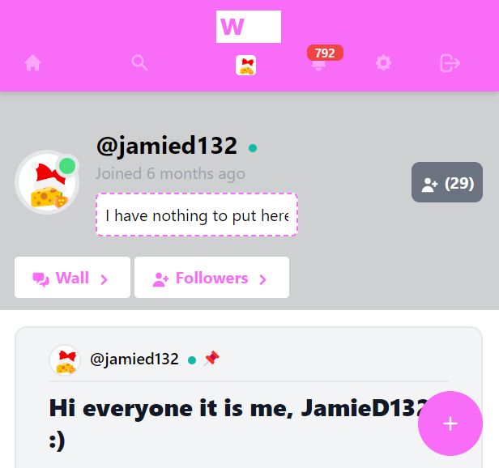
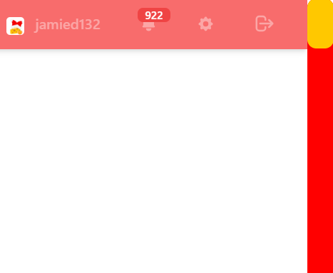
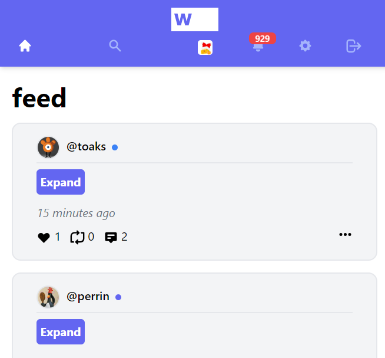
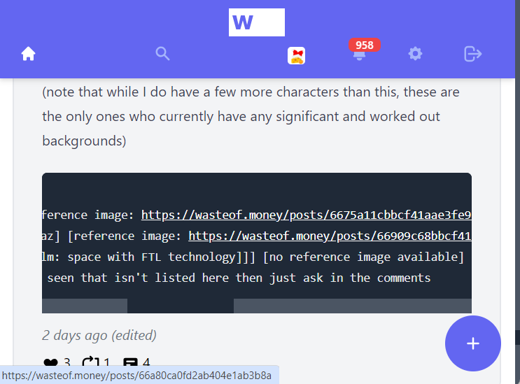
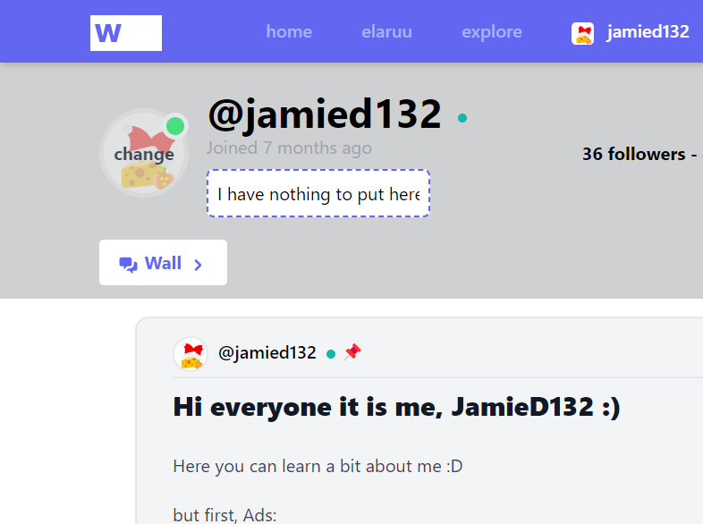

# &nbsp;&nbsp;wasteof-addons

A chrome/edge extension to customise wasteof.money

## Features

- Website theme customizer
- Custom scrollbars
- Collapsible posts
- Link highlighting in code blocks

### Coming Soon:
- Custom navbar links
- Custom website font

## Installation
(instructions also available at https://addons.wasteof.me/get)

1. Unzip
    
    Open the downloaded zip file in explorer. Right click on it, and select "unzip" or "extract archive". This should create a new folder with the same name.

2. Open extensions

    If you are on Google Chrome: go to chrome://extensions

    If you are on Microsoft Edge: go to edge://extensions

3. Turn on developer mode

    Make sure you have developer mode turned on. On Google Chrome this should be in the top right corner, and on Edge it should be on the side.

4. Upload extension

    After turning on developer mode, a button should appear saying "load unpacked." Select this button. Then navigate to where you downloaded the extension, select the folder, and press upload.
    
## Screenshots

<table>
  <tr>
    <td></td>
    <td></td>
    <td></td>
  </tr>
  <tr>
    <td></td>
    <td></td>
  </tr>
</table>
readme created by @silicone-fig
